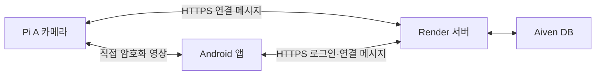

# 직접 영상 연결 (Android 1.2 / WebRTC)

영상은 **Pi ↔ 휴대폰 WebRTC**로 전송합니다. Render는 로그인·기기 소유권 확인과 짧은 SDP 연결 메시지만 처리합니다. Pi가 Render로 JPEG 영상을 계속 올리는 기능과 새 앱의 Render 영상 중계 호출은 제거했습니다. 서버의 이전 영상 API는 업데이트 순서를 위한 호환용으로 남아 있습니다.



Google STUN을 사용하며 유료 TURN이나 자동 JPEG 중계 전환은 설정하지 않습니다. 같은 학교망에서 다른 프로젝트가 성공했어도 실제 장치·휴대폰 조합에서 직접 연결을 확인해야 합니다. 직접 연결이 차단되면 앱에 재시도 안내를 표시합니다. 사진 저장은 계속 꺼져 있습니다.

Pi 카메라 서비스가 2초마다 HTTPS로 새 연결 요청을 확인하므로, 정상 가동 중에는 15분 무접속으로 절전되는 조건에 해당하지 않습니다. 별도의10분 keep-alive는 추가하지 않습니다. Pi가 꺼지거나 연결이 끊긴 동안에는 Free 서버가 절전될 수 있으며 다음 접속에서 다시 시작합니다. 실제 Free 기동은 약2분20초였고 앱은 최초 연결을 최대3분 기다리도록 준비했습니다.

## 영상과 기존 기능

- 기본 640×480, 촬영 15fps, WebRTC 최대 12fps입니다. 촬영된 최신 JPEG만 압축 영상으로 변환하며 프레임 대기열을 쌓지 않습니다. 실제 FPS와 지연은 Pi CPU·네트워크의 영향을 받습니다.
- 앱은 내장 WebView의 수신 전용 영상 플레이어를 씁니다. 로그인 토큰은 Android 코드에만 있으며 페이지나 URL에 전달하지 않습니다.
- 앱 화면을 벗어나면 peer와 연결 세션을 닫습니다. 서버의 시청 확인이 45초 동안 끊기면 Pi도 전송을 종료합니다.
- 기존 CAMERA 연결, 얼굴 모델, 로컬 얼굴 인식, GPIO 설정은 유지합니다. 얼굴 인식은 기존 `ai_env`를 쓰고 영상 전송만 별도 환경을 사용합니다.
- 동시 시청은 카메라당 한 연결입니다. 새 시청 연결이 이전 연결을 종료합니다.

## 적용 순서

1. 검증한 서버를 먼저 배포하고 `/healthz` 및 새 인증 API 응답을 확인합니다.
2. 앱을 삭제하지 않고 `IDontLiveAlone-1.2.apk`를 업데이트 설치합니다. 기존 로그인과 CAMERA 연결을 유지합니다.
3. Pi에 전원을 켜고 터미널에서 다음 한 줄을 실행합니다. `video-v1.2` 태그가 공개된 후 사용합니다.

```sh
f=$(mktemp) && wget -qO "$f" https://raw.githubusercontent.com/yeonh0115/IDontLIveAlone/video-v1.2/deployment/update_camera.py && sudo python3 "$f" --apply
```

업데이트 중 전원을 유지합니다. 고정된 Git 커밋의 소스와 패키지 목록을 SHA256으로 검사하고 `/opt/idontlivealone/rtc-*`에 별도 Python 환경을 준비합니다. 기존 `ai_env`에는 패키지를 설치하지 않습니다. 공개 PyPI의 정확히 고정된 버전과 바이너리 패키지만 사용합니다. 패키지 준비가 실패하면 기존 서비스와 소스를 변경하지 않습니다.

소스·환경파일·기존 카메라 서비스 설정은 `/var/backups/idontlivealone/webrtc-update-*`에 비공개 백업합니다. 로컬 영상 시작에 실패하면 소스와 카메라 실행 환경을 복원합니다. 갑작스러운 전원 차단까지 보장하는 OS 전체 트랜잭션은 아닙니다.

`LOCAL CAMERA + WEBRTC RUNTIME OK`는 로컬 촬영과 통신 모듈 준비를 뜻합니다. `SIGNALING OK`는 Render의 연결 메시지 API가 정상 응답했다는 뜻이며 **실제 영상 성공이나 얼굴·문 동작 확인은 아닙니다**. `UPDATE STOPPED`가 나오면 그 마지막 줄을 공유합니다.

## 현장 검증

휴대폰 Wi-Fi를 끄고 LTE/5G에서 앱 홈을 확인합니다. 영상 출력, 손 움직임 지연, 화질을 확인한 다음 앱을 배경으로 보냈을 때 전송이 종료되는지 확인합니다. Pi 재부팅 후 자동 시작, 기존 얼굴 인식과 문 동작도 별도로 확인합니다. 진단 로그는 후보 종류와 수신 바이트·프레임 수만 표시하며 주소·토큰·SDP는 기록하지 않습니다.

## 비용과 검증 범위

WebRTC 직접 연결에서는 영상 바이트가 Render를 통과하지 않습니다. 인증·기기 상태·센서/얼굴 작업과 연결 메시지는 계속 HTTPS를 사용하므로 서버 전송량이 0은 아닙니다. 과거의 사용량과 청구액이 이 변경으로 취소되지는 않습니다.

Free 인스턴스는 실행 요금과 전송량 할당을 분리해 계산합니다. 월5GB를 이미 초과한 달에는 추가 HTTPS 통신도 초과 요금 대상입니다. 결제수단이 있으면 초과량을 과금하며 계속 사용할 수 있고, 없으면 다음 달까지 서비스가 중단됩니다. 무료 인스턴스로 바꾸어도 당월 전송량이 초기화되지는 않습니다.

참고 프로젝트의 223MB/5GB, 무료 실행 64.42/750시간, 예상 청구액 $0은 해당 프로젝트의 2026-09-17 스냅샷입니다. 서로 사용 시간과 조건이 다르므로 우리 서비스의 절감률이나 무조건 무료라는 보장으로 환산하지 않습니다. [Render 전송량 정책](https://render.com/docs/outbound-bandwidth), [무료 인스턴스 제한](https://render.com/docs/free), [WebRTC 연결 방식](https://webrtc.org/getting-started/peer-connections)을 참고합니다.

이전 JPEG 개선 후보는 `checkpoint/jpeg-candidate-2026-09-17`, 기존 운영 소스는 `checkpoint/pre-video-quality-2026-09-17`에 보관합니다. 이 문서는 코드와 설치 방법을 설명하며 실제 배포·Pi 설치·LTE 시험 완료를 주장하지 않습니다.
